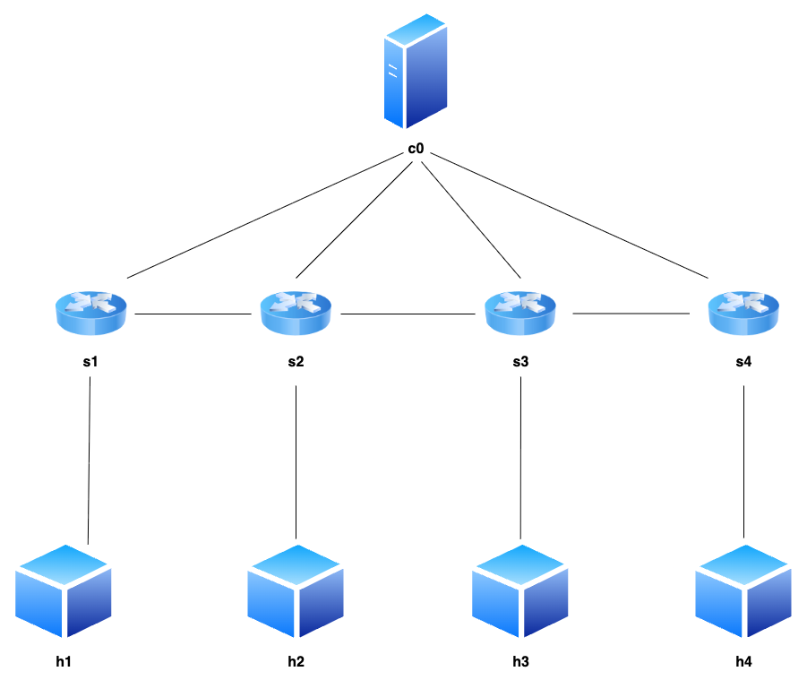
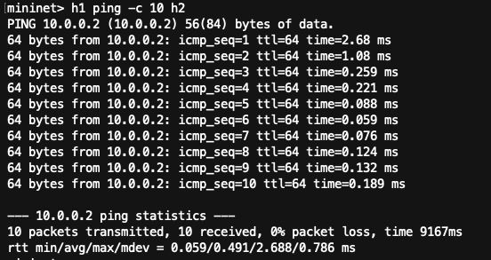
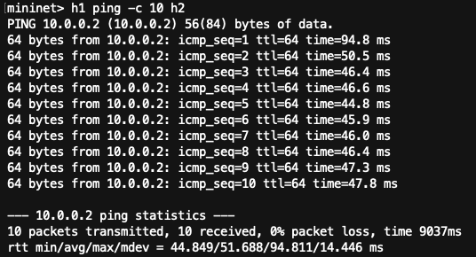
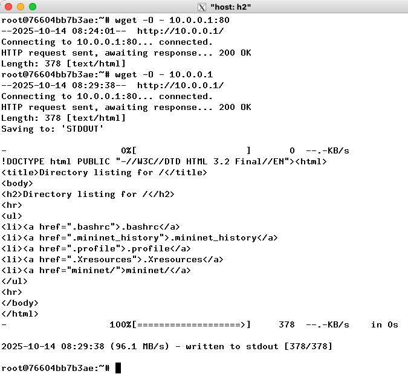

# INFORME 1 - Enrique Sopeña Urbano

---

## Pregunta 1

---

Resultados del comando `route` sobre los distintos nodos:

- **h1**
    
    ```
    Destination  Gateway  Genmask     Flags Iface
    10.0.0.0     0.0.0.0  255.0.0.0   U     h1-eth0
    ```
    
    **Interpretación:** solo tiene ruta conectada a **10.0.0.0/8** por `h1-eth0`. No hay *default route*.
    
- **h2**
    
    ```
    Destination  Gateway  Genmask     Flags Iface
    10.0.0.0     0.0.0.0  255.0.0.0   U     h2-eth0
    ```
    
    **Interpretación:** igual que h1: red directa **10.0.0.0/8**, sin ruta por defecto.
    
- **s1** (switch en *root namespace* del contenedor)
    
    ```
    Destination  Gateway     Genmask     Flags Iface
    default      172.17.0.1  0.0.0.0     UG    eth0
    172.17.0.0   0.0.0.0     255.255.0.0 U     eth0
    ```
    
    **Interpretación:** ve la red Docker del host (**172.17.0.0/16**) y tiene **ruta por defecto** vía **172.17.0.1** por `eth0`.
    
- **c0** (controlador, también en *root namespace*)
    
    ```
    Destination  Gateway     Genmask     Flags Iface
    default      172.17.0.1  0.0.0.0     UG    eth0
    172.17.0.0   0.0.0.0     255.255.0.0 U     eth0
    ```
    
    **Interpretación:** igual que s1: pertenece a la red Docker con **default route** vía **172.17.0.1**.
    

## Pregunta 2

---



## Pregunta 3

---

### Sin parámetros

Para esta prueba se ha ejecutado el siguiente comando en mininet con el arranque por defecto (`# mn`):

```bash
mininet>h1 ping -c 10 h2
```

Y el resultado ha sido el siguiente: el tiempo promedio ha sido de 0.491ms por envio



### Con parámetros

Para esta prueba se ha ejecutado en la terminal el siguiente comando:

```bash
$  mn --link tc,bw=10,delay=10ms
```

De esta manera lo ejecutamos con “link parameters”. En mininet se ha ejecutado el mismo comando que sin parametros:

```bash
mininet>h1 ping -c 10 h2
```

Y el resultado ha sido el siguiente: el tiempo promedio ha sido de 51.688 ms por envío



### Conclusión

La diferencia entre ambos casos es de aproximadamente **51.2 ms**, lo que coincide con el retardo añadido artificialmente a los enlaces. Dado que el parámetro `delay=10ms` se aplica a cada enlace y en el camino existen dos enlaces (`h1–s1` y `s1–h2`), el retardo total de ida es de unos **20 ms**, y el de vuelta de otros **20 ms**, sumando cerca de **40 ms adicionales** al tiempo de ida y vuelta teórico. La pequeña diferencia restante hasta los **51 ms** medidos se debe al **overhead de virtualización**, a la **variabilidad introducida por `tc netem`** y a los picos iniciales de comunicación (por ejemplo, ARP o instalación de flujos en OVS).

El parámetro `bw=10` (10 Mbps) no afecta de manera significativa al tiempo de respuesta del `ping`, ya que los paquetes ICMP son muy pequeños y no saturan el ancho de banda. Por tanto, el incremento observado en el RTT se debe casi exclusivamente al **retardo artificial introducido por el parámetro `delay`**.

## Pregunta 4

---

### Sin parámetros

Para esta prueba se ha ejecutado el siguiente comando en mininet con el arranque por defecto (`# mn`):

```bash
mininet>iperf h1 h2
```

Y el resultado ha sido de 63,8 Gbits/sec | 64.0 GBit/sec


### Con parámetros

Para esta prueba se ha ejecutado en la terminal el siguiente comando:

```bash
$  mn --link tc,bw=10,delay=10ms
```

De esta manera lo ejecutamos con “link parameters”. En mininet se ha ejecutado el mismo comando que sin parametros:

```bash
mininet>iperf h1 h2
```

Y el resultado ha sido de 9,45Mbits/sec | 10,8MBit/sec


### Conclusión

Al comparar ambos casos, se observa una **diferencia muy significativa** en el rendimiento de la red.

Sin parámetros, el ancho de banda medido alcanza unos **64 Gbit/s**, mientras que al aplicar los *link parameters* (`bw=10, delay=10ms`) el rendimiento cae a alrededor de **10 Mbit/s**.

Esta diferencia se debe principalmente al parámetro `bw=10`, que **limita el ancho de banda máximo disponible** en los enlaces. El parámetro `delay=10ms` apenas influye en la tasa de transferencia, aunque añade algo de latencia.

## Pregunta 5

---

Se utilizó la topología mínima por defecto (h1—s1—h2).

Desde `h1` se lanzó un servidor web sencillo con Python:

```bash
python2 -m SimpleHTTPServer 80 &
```


y desde `h2` se ejecutó el cliente:

```bash
wget -O - 10.0.0.1
```

obteniendo correctamente la respuesta HTTP del servidor.



A su vez, en la terminal de h1, se puede observar que ha llegado la petición y su estado:


Para finalizar con el proceso del servidor, basta con ejecutar `Ctrl + C` y el siguiente comando en `h1`:

```bash
kill %python2
```

## Pregunta 6

---

### Cambios realizados

Se modificó el script `fourhostnet.py` para que, tras iniciar la red, **muestre automáticamente la dirección IP y la dirección MAC de cada host**.

Para evitar repetir código, se implementó un **bucle `for`** que genera dinámicamente los cuatro hosts (`h1` a `h4`), asignándoles sus direcciones IP de forma secuencial (`10.0.0.1` a `10.0.0.4`) y guardando los objetos creados en una lista llamada `hosts`.

Posteriormente, se recorre esa lista con otro bucle para **crear los enlaces** entre cada host y el switch `s1`.

Una vez iniciada la red con `net.start()`, se usa nuevamente un bucle para recorrer todos los hosts y **mostrar por consola su nombre, IP y MAC**, mediante los métodos `h.IP()` y `h.MAC()`.

Finalmente, se abre la interfaz de comandos de Mininet (`CLI(net)`) para poder interactuar con la red antes de detenerla con `net.stop()`.

### Código modificado

`fourhostnet_modified.py` :

```python
#!/usr/bin/python
# File: fourhostnet.py
from mininet.net import Mininet
from mininet.node import OVSController
from mininet.cli import CLI
from mininet.log import setLogLevel, info

def emptyNet():

    "Create an empty network and add nodes to it."

    net = Mininet(controller=OVSController)

    info('*** Adding controller\n')
    net.addController('c0')

    info('*** Adding hosts\n')
    hosts = []
    for i in range(1, 5):
        name = 'h%d' % i
        ip = '10.0.0.%d' % i
        host = net.addHost(name, ip=ip)
        hosts.append(host)

    info('*** Adding switch\n')
    s1 = net.addSwitch('s1')

    info('*** Creating links\n')
    for h in hosts:
        net.addLink(h, s1)

    info('*** Starting network\n')
    net.start()

    info('*** Displaying IP and MAC addresses for each host\n')
    for h in hosts:
        info('%s: IP=%s  MAC=%s\n' % (h.name, h.IP(), h.MAC()))

    info('*** Running CLI\n')
    CLI(net)

    info('*** Stopping network\n')
    net.stop()

if __name__ == '__main__':
    setLogLevel('info')
    emptyNet()

```

### Resultado


## Pregunta 7

---

### Modificaciones

Se modificó el script fourhostnet_modified.py para añadir parámetros de rendimiento a los enlaces mediante la clase TCLink.

1. Se importó `TCLink` desde `mininet.link` y se indicó su uso al crear la red:
    
    ```python
    net = Mininet(controller=OVSController, link=TCLink)
    ```
    
2. En el bucle de creación de enlaces se añadieron los parámetros:
    
    ```python
    net.addLink(h, s1, bw=10, delay='10ms')
    ```
    

De esta manera, todos los enlaces del switch `s1` tienen un **ancho de banda máximo de 10 Mbps** y un **retardo de 10 ms**.

### Pruebas

Las pruebas de rendimiento se realizarán desde la consola de Mininet (`CLI(net)`), utilizando los siguientes comandos:

```bash
mininet> h1 ping -c 5 h3
```


```python
mininet> iperf h1 h3
```


**Conclusiones**

Las pruebas realizadas con la topología modificada (`bw=10`, `delay=10ms`) muestran que el rendimiento y la latencia se ajustan a los parámetros configurados.

El comando `ping -c 5 h3` devolvió un **RTT medio de 58,4 ms**, valor coherente con los **10 ms de retardo por enlace**, ya que el paquete debe atravesar varios saltos entre `h1` y `h3` y el tiempo se duplica por el recorrido de ida y vuelta.

Por otro lado, la prueba de ancho de banda mediante `iperf h1 h3` arrojó un resultado de **9,48–11,0 Mbit/s**, coincidiendo con el límite impuesto por el parámetro `bw=10`.