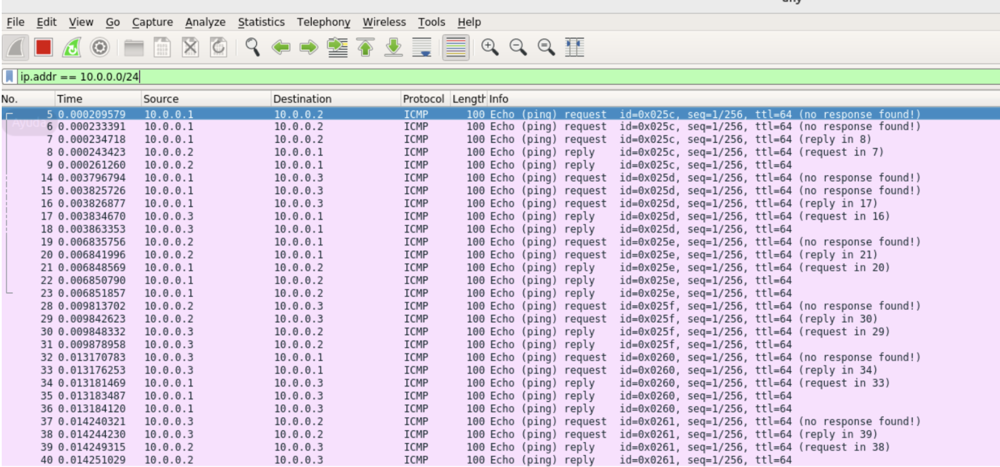

# INFORME 2 - Enrique Sopeña Urbano

---

## Pregunta 1

---

```python
mininet> pingall
*** Ping: testing ping reachability
h1 -> h2 h3
h2 -> h1 h3
h3 -> h1 h2
*** Results: 0% dropped (6/6 received)
```

Tras ejecutar el comando

```bash
sh ovs-ofctl add-flow s1 action=normal
pingall
```

el resultado muestra que **todos los hosts se comunican correctamente** entre sí, con **0% de paquetes perdidos**.

Esto se debe a que la acción `normal` hace que el switch `s1` funcione como un **conmutador tradicional**, gestionando el reenvío de tramas en función de las direcciones MAC aprendidas de forma automática.

## Pregunta 2

---

Tras ejecutar el comando

```bash
sh ovs-ofctl dump-flows s1
```

se obtiene una única entrada de flujo con la acción `NORMAL`, indicando que el switch reenvía los paquetes de acuerdo con las reglas de conmutación estándar.

La salida ha sido:

```
cookie=0x0, duration=406.441s, table=0, n_packets=56, n_bytes=3920,
actions=NORMAL
```

Esto confirma que el flujo añadido previamente está activo y que el switch está procesando los paquetes correctamente.

## Pregunta 3

---

Tras eliminar las reglas del switch con

```bash
sh ovs-ofctl del-flows s1
```

y verificar que la tabla de flujos queda vacía (`dump-flows`), al ejecutar

```bash
pingall
```

se obtiene una pérdida total de paquetes (**100% dropped**).

Esto ocurre porque el switch `s1` ya no dispone de reglas de reenvío y, al no haber controlador (`--controller=none`), no puede aprender ni instalar nuevas entradas de flujo.

En consecuencia, los paquetes no se procesan y la comunicación entre hosts se interrumpe completamente.

## Pregunta 4

---

Tras añadir las reglas:

```bash
sh ovs-ofctl add-flow s1 priority=500,in_port=1,actions=output:2
sh ovs-ofctl add-flow s1 priority=500,in_port=2,actions=output:1
```

y ejecutar:

```bash
h1 ping -c2 h2
h3 ping -c2 h2
```

se observa que el **ping entre h1 y h2 funciona correctamente**, mientras que **el ping desde h3 hacia h2 falla**.

Esto se debe a que las reglas definidas solo permiten el reenvío **entre los puertos 1 y 2**, por lo que el tráfico que entra por el puerto 3 (h3) no coincide con ninguna regla y el switch lo descarta.

En consecuencia, **h3 queda fuera de la comunicación** y únicamente **h1 y h2 pueden intercambiar paquetes**.

## Pregunta 5

---

Al añadir la regla:

```bash
sh ovs-ofctl add-flow s1 priority=32768,action=drop
```

el switch `s1` deja de reenviar tráfico entre los hosts.

Al repetir los comandos:

```bash
h1 ping -c2 h2
h3 ping -c2 h2
```

se observa una **pérdida total de paquetes (100%)** en ambos casos.

Esto ocurre porque la nueva regla tiene una **prioridad superior (32768)** y una acción de `drop`, por lo que **intercepta y descarta todo el tráfico** antes de que puedan aplicarse las demás reglas de menor prioridad.

En consecuencia, el switch actúa como un **filtro que bloquea todas las comunicaciones**.

## Pregunta 6

---

La primera línea configura una regla general para todo el tráfico IPv4 dentro de la subred `10.0.0.0/24`, que se reenvía de forma normal sin aplicar ninguna modificación.

La segunda línea añade una regla con mayor prioridad que afecta únicamente al tráfico originado desde `h3` (`10.0.0.3`).

Esta regla modifica el campo **DSCP (Differentiated Services Code Point)** del encabezado IP, asignándole el valor **46 (Expedited Forwarding)**, que se codifica como `mod_nw_tos:184`.

Con ello, los paquetes enviados desde `h3` reciben **prioridad de envío superior**, implementando un mecanismo básico de **calidad de servicio (QoS)** dentro de la red.

## Pregunta 7

---
Tras añadir las reglas ARP específicas en el switch:
```shell

sh ovs-ofctl add-flow s1 arp,nw_dst=10.0.0.1,actions=output:1
sh ovs-ofctl add-flow s1 arp,nw_dst=10.0.0.2,actions=output:2
sh ovs-ofctl add-flow s1 arp,nw_dst=10.0.0.3,actions=output:3
```

y ejecutar el comando pingall, la comunicación entre los tres hosts se estableció correctamente, obteniendo 0% de pérdida de paquetes.
Estas reglas permiten que las peticiones ARP lleguen únicamente al host correspondiente, evitando el uso de flooding generalizado en la red.

Para comprobar el correcto funcionamiento, se abrió Wireshark en el adaptador any utilizando el filtro:

```shell
ip.addr == 10.0.0.0/24
```

En la captura se observan múltiples paquetes ICMP (solicitudes y respuestas Echo request / Echo reply) entre los hosts 10.0.0.1, 10.0.0.2 y 10.0.0.3.
En particular, los paquetes originados en h3 (10.0.0.3) muestran el campo DSCP modificado a Expedited Forwarding (46) — representado en hexadecimal como 0xb8 —, lo que confirma que el switch aplicó correctamente la modificación establecida en la regla:

```shell
sh ovs-ofctl add-flow s1 priority=800,dl_type=0x800,nw_src=10.0.0.3,nw_dst=10.0.0.0/24,actions=mod_nw_tos:184,normal
```



## Pregunta 8

---

La última regla:

```bash
sh ovs-ofctl add-flow s1 priority=800,ip,nw_src=10.0.0.3,actions=normal
```

se utiliza para permitir que el **tráfico IP originado en el host h3 (10.0.0.3)** —donde se ejecuta el servidor web— sea reenviado normalmente hacia los demás hosts de la red.

Su prioridad (800) es superior a la de la regla anterior (500), por lo que se aplica primero y evita que las respuestas del servidor sean afectadas por otras reglas de redirección.

En otras palabras, esta regla **habilita el retorno del tráfico HTTP** desde h3 hacia h1 y h2, garantizando el funcionamiento correcto de la comunicación cliente-servidor.

## Pregunta 9

---


Para visualizar los puertos de un switch en la interfaz gráfica de **ONOS**, se debe hacer clic directamente sobre el **icono del switch** en el panel principal de la topología.

Al hacerlo, aparece un **panel lateral derecho** con información detallada del dispositivo, incluyendo una pestaña **“Ports”** donde se listan todos los puertos, su estado, velocidad y direcciones MAC.

En dicha vista se pueden consultar fácilmente los detalles de los puertos de cualquier switch de la topología.

## Pregunta 10

---

Tras ejecutar el script `firewall.py`, las políticas definidas en el archivo `firewall-policies.csv` se cargaron correctamente en la aplicación **ACL (`org.onosproject.acl`)** del controlador ONOS.

Estas reglas se tradujeron automáticamente en **flujos OpenFlow** que fueron instalados en los switches de la red.

En la interfaz gráfica de ONOS, dentro del apartado **“Flows”**, se seleccionó el **switch 2** (`of:0000000000000002`).

En la vista de detalle se pueden observar **ocho reglas activas**, de las cuales las primeras cuatro pertenecen a la aplicación **`*acl`**, y las restantes corresponden a flujos básicos gestionados por el núcleo del sistema (`*core`).

Cada regla del ACL especifica un par de direcciones MAC origen y destino (`ETH_SRC` y `ETH_DST`) junto con la acción asociada (`imm[NOACTION]`), lo que indica que el tráfico entre esas direcciones está **bloqueado** conforme a la política definida.

