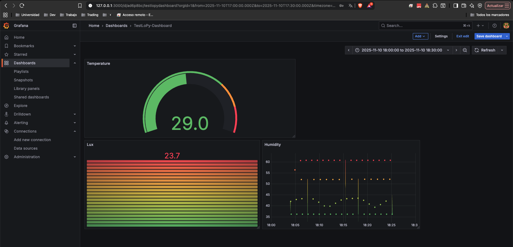

# INFORME 6 - Enrique Sopeña Urbano

## Pregunta 1

La **dashboard creada en Grafana** permite visualizar en tiempo real los datos procedentes de los sensores conectados a **The Things Network (TTN)** y almacenados en **InfluxDB**. En ella se incluyen tres paneles distintos: un indicador tipo **Gauge** que muestra la temperatura actual, una barra de color que representa los valores de **luminosidad (Lux)** y un gráfico temporal de **humedad**, donde se observa la variación de los datos a lo largo del tiempo. 



## Pregunta 2


En esta segunda tarea se desarrolló un script en **Python** que permite consultar los datos almacenados en **InfluxDB** y mostrar por consola los valores de **temperatura**, **humedad** y **luminosidad** registrados en los últimos 15 minutos. Para ello, se estableció la conexión con la base de datos `telegraf` mediante la clase `InfluxDBClient`, indicando la dirección IP del contenedor donde se ejecuta InfluxDB dentro de la red compartida de Docker. A través de una consulta en lenguaje **InfluxQL**, se recuperan las medidas recientes y se imprimen únicamente aquellas cuyo valor no es nulo. La ejecución del programa muestra en consola una lista de registros con su marca temporal y los valores correspondientes de cada variable, lo que permite verificar el correcto almacenamiento y lectura de los datos del sistema IoT.

```bash
2025-11-10T19:15:18.539002Z  -> Temperatura: 25.25
2025-11-10T19:15:18.539002Z  -> Humedad: 52.654998779296875
2025-11-10T19:15:18.539002Z  -> Luminosidad: -17.0
...
...
...
2025-11-10T19:29:53.208806Z  -> Temperatura: 27.110275268554688
2025-11-10T19:29:53.208806Z  -> Humedad: 43.816131591796875
2025-11-10T19:29:53.208806Z  -> Luminosidad: -1.0
```