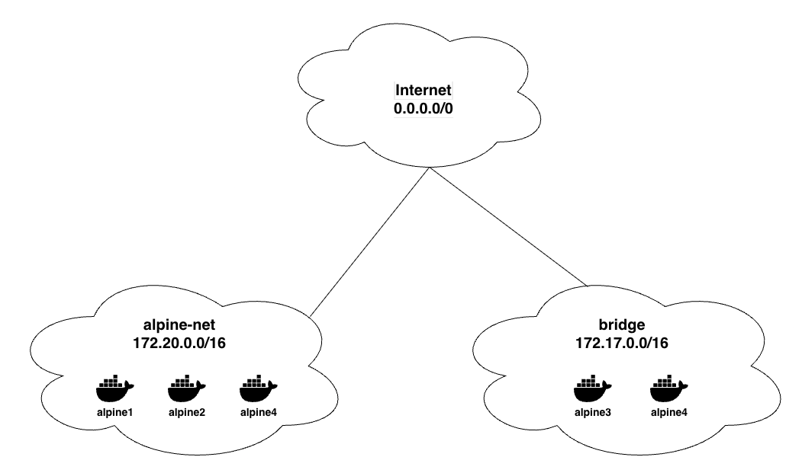

# INFORME 7- Enrique Sopeña Urbano

## Pregunta 1

### Pasos ejecutados:

ubu1:

```bash
docker run -dit --name ubu1 ubunt
docker exec -it ubu1 /bin/bash
# echo "Contenido de test1 de ubu1" > test1
exit
```

ubu2:

```bash
docker run -dit --name ubu2 ubuntu
docker exec -it ubu2 /bin/bash
# echo "Contenido de test2 de ubu2" > test2
CTRL+p CTRL+q
```

### Preguntas

1. ¿Qué secuencia de comandos debes utilizar para ejecutar `ls -l` dentro de **ubu1** y **ubu2**, comprobando que en cada contenedor existe el archivo que creaste?
    1. Ubu1: 
        
        Comando:
        
        ```bash
        docker exec ubu1 ls -l /
        ```
        
        Resultado:
        
        ```bash
        total 52
        lrwxrwxrwx   1 root root    7 Apr 22  2024 bin -> usr/bin
        drwxr-xr-x   2 root root 4096 Apr 22  2024 boot
        drwxr-xr-x   5 root root  360 Nov 15 18:34 dev
        drwxr-xr-x   1 root root 4096 Nov 15 18:34 etc
        drwxr-xr-x   3 root root 4096 Oct 13 14:12 home
        lrwxrwxrwx   1 root root    7 Apr 22  2024 lib -> usr/lib
        drwxr-xr-x   2 root root 4096 Oct 13 14:06 media
        drwxr-xr-x   2 root root 4096 Oct 13 14:06 mnt
        drwxr-xr-x   2 root root 4096 Oct 13 14:06 opt
        dr-xr-xr-x 213 root root    0 Nov 15 18:34 proc
        drwx------   1 root root 4096 Nov 15 18:38 root
        drwxr-xr-x   4 root root 4096 Oct 13 14:12 run
        lrwxrwxrwx   1 root root    8 Apr 22  2024 sbin -> usr/sbin
        drwxr-xr-x   2 root root 4096 Oct 13 14:06 srv
        dr-xr-xr-x  11 root root    0 Nov 15 18:34 sys
        -rw-r--r--   1 root root   27 Nov 15 18:37 test1 # -> Aqui está el fichero
        drwxrwxrwt   2 root root 4096 Oct 13 14:12 tmp
        drwxr-xr-x  11 root root 4096 Oct 13 14:06 usr
        drwxr-xr-x  11 root root 4096 Oct 13 14:12 var
        ```
        
    2. Ubu2:
        
        Comando:
        
        ```bash
        docker exec ubu1 ls -l /
        ```
        
        Resultado:
        
        ```bash
        total 52
        lrwxrwxrwx   1 root root    7 Apr 22  2024 bin -> usr/bin
        drwxr-xr-x   2 root root 4096 Apr 22  2024 boot
        drwxr-xr-x   5 root root  360 Nov 15 18:34 dev
        drwxr-xr-x   1 root root 4096 Nov 15 18:34 etc
        drwxr-xr-x   3 root root 4096 Oct 13 14:12 home
        lrwxrwxrwx   1 root root    7 Apr 22  2024 lib -> usr/lib
        drwxr-xr-x   2 root root 4096 Oct 13 14:06 media
        drwxr-xr-x   2 root root 4096 Oct 13 14:06 mnt
        drwxr-xr-x   2 root root 4096 Oct 13 14:06 opt
        dr-xr-xr-x 213 root root    0 Nov 15 18:34 proc
        drwx------   2 root root 4096 Oct 13 14:12 root
        drwxr-xr-x   4 root root 4096 Oct 13 14:12 run
        lrwxrwxrwx   1 root root    8 Apr 22  2024 sbin -> usr/sbin
        drwxr-xr-x   2 root root 4096 Oct 13 14:06 srv
        dr-xr-xr-x  11 root root    0 Nov 15 18:46 sys
        -rw-r--r--   1 root root   27 Nov 15 18:39 test2 # -> Aqui está el fichero
        drwxrwxrwt   2 root root 4096 Oct 13 14:12 tmp
        drwxr-xr-x  11 root root 4096 Oct 13 14:06 usr
        drwxr-xr-x  11 root root 4096 Oct 13 14:12 var
        ```
        
2. ¿Qué comando usarías para mostrar el **contenido real** de cada archivo (`test1` y `test2`) directamente desde tu máquina anfitriona, sin entrar manualmente en los contenedores?
    1. Ubu1: 
        
        Comando:
        
        ```bash
        docker exec ubu1 cat /test1
        ```
        
        Resultado:
        
        ```bash
        Contenido de test1 de ubu1
        ```
        
    2. Ubu2:
        
        Comando:
        
        ```bash
        docker exec ubu1 cat /test2
        ```
        
        Resultado:
        
        ```bash
        Contenido de test2 de ubu2
        ```
        

## Pregunta 2

### Gateway

La dirección IP asignada al *gateway* (puerta de enlace) es la que actúa como el punto de conexión entre el Docker host y la red *bridge* virtual. Esta información se encuentra dentro del bloque `IPAM -> Config`:

- Dirección IP del *Gateway*: `172.17.0.1`

El *gateway* es la primera dirección IP disponible dentro del rango de subred asignado a esta red *bridge*.

### Contenedores `alpine1` y `alpine2`

Las direcciones IP asignadas a los contenedores se encuentran dentro del bloque `Containers`, bajo la clave `IPv4Address` de cada contenedor.

- Dirección IP de `alpine1`: `172.17.0.4/16`
- Dirección IP de `alpine2`: `172.17.0.5/16`

## Pregunta 3

La determinación de la configuración IP y la conectividad de la red definida por el usuario `alpine-net` se realiza mediante el comando `docker network inspect alpine-net`. Este comando devuelve un objeto JSON que contiene los metadatos de la red, permitiendo la extracción de las variables de red relevantes.

1. Dirección de la Red `alpine-net`
    
    La dirección IP de la subred y el *gateway* asociado se localizan en la estructura `IPAM` (IP Address Management) de la salida JSON.
    
    1. Subred Asignada
        
        La subred utilizada para el direccionamiento de los contenedores conectados a `alpine-net` es: `172.20.0.0/16` , que se obtiene mirando la ruta JSON: IPAM -> Config -> Subnet.
        
    2. Dirección del Gateway
        
        La dirección del *gateway*, que representa la interfaz del Docker Host dentro de esta red, es: `172.20.0.1` ,  que se obtiene mirando la ruta JSON: IPAM -> Config -> Gateway
        
2. Dirección del *Default Bridge*
    
    La dirección del *gateway* de la red `bridge` por defecto es la que utiliza el Docker Host para la conexión de los contenedores que no especifican una red de usuario. 
    
    La dirección de la interfaz del *default bridge* es: `172.17.0.1`*.* Este valor corresponde a la clave `Gateway` localizada en `IPAM` -> `Config` al inspeccionar la red `bridge`.
    

## Pregunta 4

Para una comprensión visual de la infraestructura de red configurada, se ha generado el siguiente diagrama que ilustra la disposición de los contenedores y sus respectivas conexiones a las redes Docker.

Este esquema representa la segmentación de la red y la conectividad, diferenciando entre la red *bridge* por defecto y la red definida por el usuario `alpine-net`



## Pregunta 5

La verificación del descubrimiento automático de servicios se realiza conectándose al contenedor `alpine1` y ejecutando el comando `ping` utilizando los nombres de los contenedores de destino (`alpine2` y `alpine4`), en lugar de sus direcciones IP explícitas.

Este proceso confirma que la red definida por el usuario, `alpine-net`, proporciona un servicio DNS interno que mapea los nombres de los contenedores a sus direcciones IP dentro de esa subred.

### Secuencia de Comandos Ejecutados

La prueba se inicia conectándose al contenedor `alpine1` y luego ejecutando `ping` a los contenedores `alpine2` y `alpine4` (ambos conectados a `alpine-net`):

```
docker attach alpine1
/ # ping -c 2 alpine2
/ # ping -c 2 alpine4
```

### Resultados de la Resolución de Nombres

```bash
/ # ping -c 2 alpine2
PING alpine2 (172.20.0.3): 56 data bytes
64 bytes from 172.20.0.3: seq=0 ttl=64 time=0.515 ms
64 bytes from 172.20.0.3: seq=1 ttl=64 time=0.289 ms

--- alpine2 ping statistics ---
2 packets transmitted, 2 packets received, 0% packet loss

/ # ping -c 2 alpine4
PING alpine4 (172.20.0.4): 56 data bytes
64 bytes from 172.20.0.4: seq=0 ttl=64 time=0.311 ms
64 bytes from 172.20.0.4: seq=1 ttl=64 time=0.296 ms

--- alpine4 ping statistics ---
2 packets transmitted, 2 packets received, 0% packet loss
```

Se confirma que, dentro de la red definida por el usuario `alpine-net`, el contenedor **`alpine1`** es capaz de **resolver automáticamente** los nombres de sus pares (`alpine2` y `alpine4`) a sus direcciones IP correspondientes, y establecer comunicación satisfactoriamente.

## Pregunta 6

La pregunta requiere verificar si el contenedor `alpine1` (conectado a `alpine-net`) puede comunicarse con `alpine3` (conectado solo al *default bridge*) utilizando la dirección IP de este último.

### Determinación de la Dirección IP de `alpine3`

La dirección IP asignada a `alpine3` fue obtenida mediante el comando `docker inspect alpine3` en la máquina anfitriona. Este comando muestra la configuración detallada del contenedor, incluyendo sus asignaciones de red.

```bash
docker inspect alpine3
# ... 
# "bridge": {
#     "IPAddress": "172.17.0.2", 
# ...
```

IP Determinada de `alpine3`: `172.17.0.2`

### Prueba de Conectividad (Ping por IP)

```bash
/ # ping -c 2 172.17.0.2
PING 172.17.0.2 (172.17.0.2): 56 data bytes

--- 172.17.0.2 ping statistics ---
2 packets transmitted, 0 packets received, 100% packet loss
```

El resultado obtenido es una pérdida del 100% de paquetes, con el error `Host is unreachable`.

Esto confirma que:

- `alpine1` no puede comunicarse con `alpine3` por nombre (como se indicó en la teoría).
- `alpine1` tampoco puede comunicarse con `alpine3` por dirección IP.

La razón es que los contenedores en redes de usuario aisladas (como `alpine-net`) no tienen conectividad directa con los contenedores que solo están en la red *bridge* por defecto (`172.17.0.0/16`). La comunicación entre estas subredes solo es posible a través del *Docker Host* (a no ser que se configure explícitamente el *IP routing* o *IPTables* en el host, que no es el caso por defecto).

## Pregunta 7

El contenedor `alpine4` está conectado a la red definida por el usuario `alpine-net` (`172.20.0.0/16`) y también a la red `bridge` por defecto (`172.17.0.0/16`). Esta doble conectividad le otorga un alcance total a todos los contenedores creados.

El análisis se realiza conectándose a `alpine4` y ejecutando el comando `ping` hacia el resto de los contenedores (`alpine1`, `alpine2`, y `alpine3`).

### Comandos de Inspección y Conexión

Para la prueba, se utiliza la siguiente información de red:

- `alpine4` se conecta a `alpine1` y `alpine2` a través de la red `alpine-net` (soporta nombres).
- `alpine4` se conecta a `alpine3` a través de la red `bridge` (no soporta resolución de nombres entre subredes).
- IP de `alpine3`: `172.17.0.2` (Determinada en la Pregunta 6).

### Prueba de Conectividad

Nos conectamos a `alpine4` y ejecutamos las pruebas:

```bash
/ # ping -c 2 alpine1
PING alpine1 (172.20.0.2): 56 data bytes
64 bytes from 172.20.0.2: seq=0 ttl=64 time=0.211 ms
64 bytes from 172.20.0.2: seq=1 ttl=64 time=0.205 ms

--- alpine1 ping statistics ---
2 packets transmitted, 2 packets received, 0% packet loss

/ # ping -c 2 alpine3
ping: bad address 'alpine3' # Falla la resolución por nombre

/ # ping -c 2 172.17.0.2
PING 172.17.0.2 (172.17.0.2): 56 data bytes
64 bytes from 172.17.0.2: seq=0 ttl=64 time=0.150 ms
64 bytes from 172.17.0.2: seq=1 ttl=64 time=0.158 ms

--- 172.17.0.2 ping statistics ---
2 packets transmitted, 2 packets received, 0% packet loss

/ # ping -c 2 alpine2
PING alpine2 (172.20.0.3): 56 data bytes
64 bytes from 172.20.0.3: seq=0 ttl=64 time=0.180 ms
64 bytes from 172.20.0.3: seq=1 ttl=64 time=0.191 ms

--- alpine2 ping statistics ---
2 packets transmitted, 2 packets received, 0% packet loss
```

La verificación de la conectividad desde el contenedor `alpine4` ha demostrado la importancia de las redes definidas por el usuario en Docker. Gracias a su doble conexión a la red `alpine-net` y a la red `bridge` por defecto, `alpine4` es el único contenedor con alcance total en la topología implementada. Se confirmó que la comunicación con contenedores en la misma red de usuario (`alpine1` y `alpine2`) es posible tanto por IP como por nombre, gracias al servicio de descubrimiento automático de servicios (DNS interno) que Docker proporciona en las redes de usuario. En contraste, la comunicación con el contenedor que reside únicamente en la red *bridge* por defecto (`alpine3`) solo es posible por IP (`172.17.0.2`), ya que la resolución de nombres no se extiende de forma automática a través de los límites de las redes, obligando a utilizar el direccionamiento explícito para alcanzar ese segmento aislado.

## Pregunta 8

La prueba final de la práctica consistió en verificar la conectividad de los contenedores a Internet, independientemente de la configuración de red interna a la que estuvieran sujetos. La prueba se realizó con éxito desde tres tipos de contenedores: `alpine4` (doble conexión), `alpine3` (solo red *bridge* por defecto), y `alpine1` (solo red de usuario `alpine-net`).

En los tres escenarios, la ejecución del comando `ping` hacia un dominio externo (`google.com`) resultó en una pérdida de paquetes del 0%.

Esto demuestra que tanto la red *bridge* por defecto como las redes *bridge* definidas por el usuario (`alpine-net`) otorgan acceso a Internet a los contenedores de forma automática. Esta funcionalidad se logra gracias a que el Docker Host actúa como puerta de enlace (*gateway*) para todas las subredes internas, utilizando NAT (Network Address Translation) para enmascarar las direcciones IP internas (`172.17.x.x` o `172.20.x.x`) con la dirección IP de la máquina anfitriona antes de enviar el tráfico al exterior.

### Detalle de los Resultados de la Prueba

```bash
docker attach alpine1
/ # ping -c 2 google.com
PING google.com (142.250.178.174): 56 data bytes
64 bytes from 142.250.178.174: seq=0 ttl=63 time=19.642 ms
64 bytes from 142.250.178.174: seq=1 ttl=63 time=20.988 ms

--- google.com ping statistics ---
2 packets transmitted, 2 packets received, 0% packet loss
round-trip min/avg/max = 19.642/20.315/20.988 ms
/ # read escape sequence

docker attach alpine2
/ # ping -c 2 google.com
PING google.com (142.250.178.174): 56 data bytes
64 bytes from 142.250.178.174: seq=0 ttl=63 time=20.078 ms
64 bytes from 142.250.178.174: seq=1 ttl=63 time=19.657 ms

--- google.com ping statistics ---
2 packets transmitted, 2 packets received, 0% packet loss
round-trip min/avg/max = 19.657/19.867/20.078 ms
/ # read escape sequence

docker attach alpine3
/ # ping -c 2 google.com
PING google.com (142.250.178.174): 56 data bytes
64 bytes from 142.250.178.174: seq=0 ttl=63 time=16.604 ms
64 bytes from 142.250.178.174: seq=1 ttl=63 time=21.042 ms

--- google.com ping statistics ---
2 packets transmitted, 2 packets received, 0% packet loss
round-trip min/avg/max = 16.604/18.823/21.042 ms
/ # read escape sequence

docker attach alpine4
/ # ping -c 2 google.com
PING google.com (142.250.178.174): 56 data bytes
64 bytes from 142.250.178.174: seq=0 ttl=63 time=17.810 ms
64 bytes from 142.250.178.174: seq=1 ttl=63 time=20.803 ms

--- google.com ping statistics ---
2 packets transmitted, 2 packets received, 0% packet loss
round-trip min/avg/max = 17.810/19.306/20.803 ms
/ # read escape sequence
```